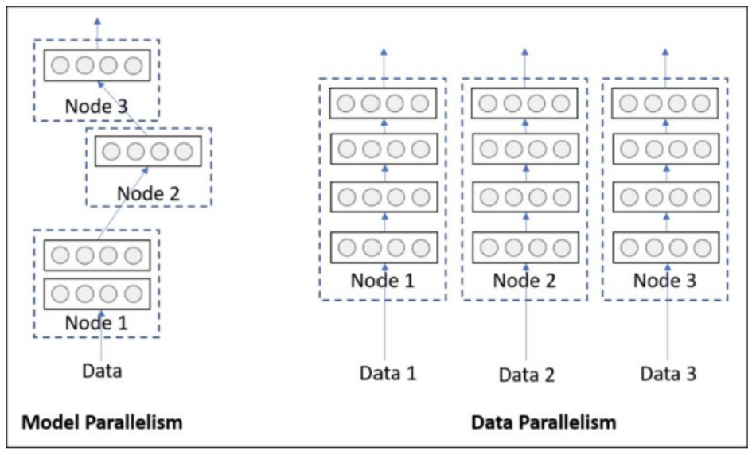
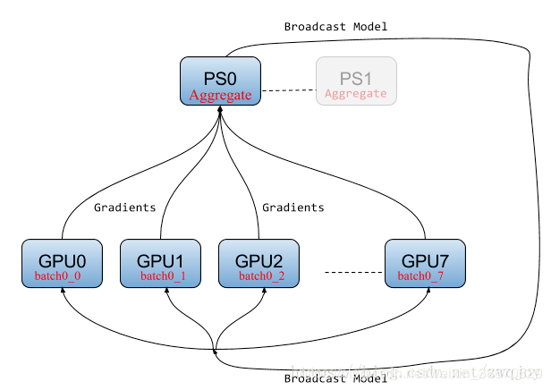
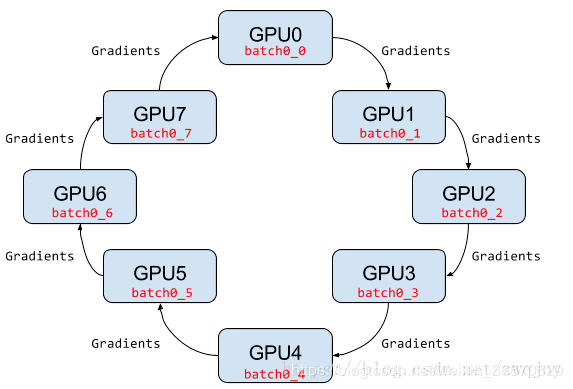
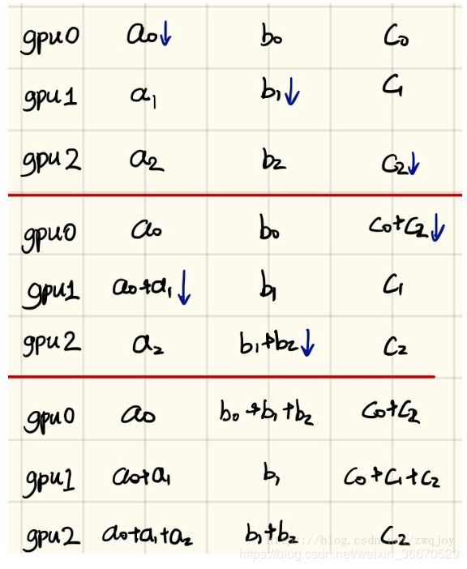
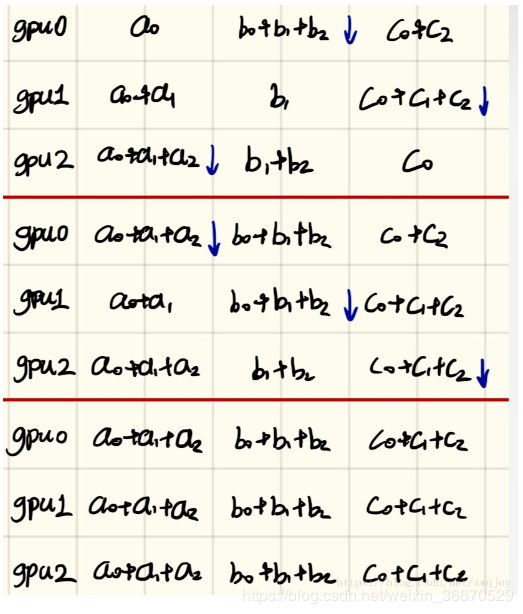

# 分布式训练

refer https://github.com/pytorch/elastic/tree/master/examples/multi_container

## 分布式类型：
+ 数据并行
+ 模型并行

## 使用的组件和架构
+ torchelastic 弹性训练
+ etcd 分布式键值一致性服务，服务注册和发现
+ nfs 网络文件系统
+ docker 容器化训练
+ amp 混合精度加速

通过 NCCL 实现 GPU 通信
## 分布式训练系统架构

### Parameter server架构
在Parameter server架构（PS架构）中，集群中的节点被分为两类：parameter server和worker。其中parameter server存放模型的参数，而worker负责计算参数的梯度。在每个迭代过程，worker从parameter sever中获得参数，然后将计算的梯度返回给parameter server，parameter server聚合从worker传回的梯度，然后更新参数，并将**新的参数**广播给worker

### Ring-allreduce架构
在Ring-allreduce架构中，各个设备都是worker，并且形成一个环，如下图所示，没有中心节点来聚合所有worker计算的梯度。在一个迭代过程，每个worker完成自己的mini-batch训练，计算出梯度，并将梯度传递给环中的下一个worker，同时它也接收从上一个worker的梯度。对于一个包含N个worker的环，各个worker需要收到其它N-1个worker的梯度后就可以更新模型参数。其实这个过程需要两个部分：scatter-reduce和allgather

两个步骤：

 

### 速度
	 使用分布式：32batch*3--->2.16s/item(3台计算机2060)
	 不使用分布式：32batch--->1.87s/item(1台计算机2060)
### 代码构成：
	0. os.environ['...'] # 环境变量设置，一些分布式训练的基本参数
	1. dist.init_process_group(backend='...','...',timeout='...') # 集群的分布式环境初始化
	2. model = Model() # 初始化模型
	    *model = DistributedDataParallel(model) # 分布式包装模型
	3. train_dataset = Dataset()
	    *train_sample = ElasticDistributed(train_dataset)  #保证不同GPU上数据的不同
	    train_loader = DatasetLoader(train_dataset, train_sample) # 分布式训练数据集设置
	4. for i in train_loader: # 常规训练
	        out = model(input)
	        loss = criterion(out,true)
	        loss.backward()
	        optim.step()